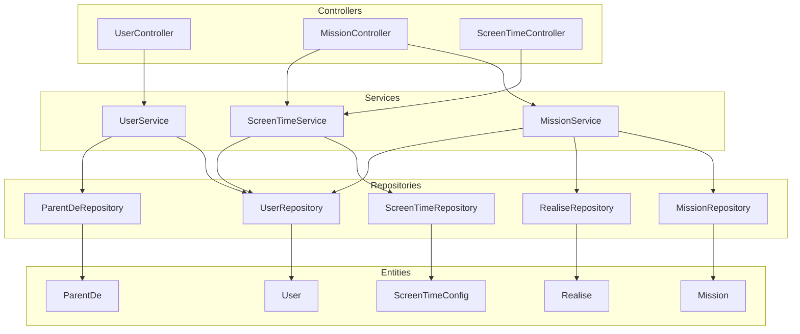

# GenZen Backend — Walkthrough

## Résumé des changements

Refonte complète du backend Spring Boot GenZen : **21 fichiers** compilés avec succès.

---

## Architecture finale



## Fichiers modifiés/créés

### Beans (8 fichiers)

| Fichier | Action | Description |
|---|---|---|
| [User.java](file:///Users/othemanek./Documents/GenZen/server/genzen/src/main/java/fr/but3/genzen/beans/User.java) | Modifié | [id](file:///Users/othemanek./Documents/GenZen/server/genzen/src/main/java/fr/but3/genzen/service/MissionService.java#96-110) Long, `@Size`, `nom`, `prenom`, `role` enum, table `users` |
| [UserRole.java](file:///Users/othemanek./Documents/GenZen/server/genzen/src/main/java/fr/but3/genzen/beans/UserRole.java) | Nouveau | Enum `PARENT` / `ENFANT` |
| [Mission.java](file:///Users/othemanek./Documents/GenZen/server/genzen/src/main/java/fr/but3/genzen/beans/Mission.java) | Modifié | Ajout `titre`, `description`, `recompenseMinutes`, `@ManyToOne createur` |
| [ParentDe.java](file:///Users/othemanek./Documents/GenZen/server/genzen/src/main/java/fr/but3/genzen/beans/ParentDe.java) | Modifié | Entité JPA complète avec `@ManyToOne parent/enfant` |
| [ParentDeId.java](file:///Users/othemanek./Documents/GenZen/server/genzen/src/main/java/fr/but3/genzen/beans/ParentDeId.java) | Nouveau | Clé composite pour [ParentDe](file:///Users/othemanek./Documents/GenZen/server/genzen/src/main/java/fr/but3/genzen/beans/ParentDe.java#6-24) |
| [Realise.java](file:///Users/othemanek./Documents/GenZen/server/genzen/src/main/java/fr/but3/genzen/beans/Realise.java) | Modifié | Relations JPA, `dateRealisation`, `dateValidation` |
| [RealiseId.java](file:///Users/othemanek./Documents/GenZen/server/genzen/src/main/java/fr/but3/genzen/beans/RealiseId.java) | Modifié | No-arg constructor, [equals](file:///Users/othemanek./Documents/GenZen/server/genzen/src/main/java/fr/but3/genzen/beans/RealiseId.java#14-23)/[hashCode](file:///Users/othemanek./Documents/GenZen/server/genzen/src/main/java/fr/but3/genzen/beans/RealiseId.java#24-28) |
| [ScreenTimeConfig.java](file:///Users/othemanek./Documents/GenZen/server/genzen/src/main/java/fr/but3/genzen/beans/ScreenTimeConfig.java) | Nouveau (remplace `Temp`) | `@ManyToOne enfant`, [date](file:///Users/othemanek./Documents/GenZen/server/genzen/src/main/java/fr/but3/genzen/service/MissionService.java#39-50) pour suivi quotidien |

### Repositories (5 fichiers) — Tous convertis en `JpaRepository`

| Fichier | Query methods ajoutées |
|---|---|
| [UserRepository.java](file:///Users/othemanek./Documents/GenZen/server/genzen/src/main/java/fr/but3/genzen/repository/UserRepository.java) | [findByEmail](file:///Users/othemanek./Documents/GenZen/server/genzen/src/main/java/fr/but3/genzen/repository/UserRepository.java#13-14), [findByEmailAndPassword](file:///Users/othemanek./Documents/GenZen/server/genzen/src/main/java/fr/but3/genzen/repository/UserRepository.java#11-12), [findByRole](file:///Users/othemanek./Documents/GenZen/server/genzen/src/main/java/fr/but3/genzen/repository/UserRepository.java#15-16) |
| [MissionRepository.java](file:///Users/othemanek./Documents/GenZen/server/genzen/src/main/java/fr/but3/genzen/repository/MissionRepository.java) | [findByCreateurId](file:///Users/othemanek./Documents/GenZen/server/genzen/src/main/java/fr/but3/genzen/repository/MissionRepository.java#10-11) |
| [RealiseRepository.java](file:///Users/othemanek./Documents/GenZen/server/genzen/src/main/java/fr/but3/genzen/repository/RealiseRepository.java) | [findByEnfantId](file:///Users/othemanek./Documents/GenZen/server/genzen/src/main/java/fr/but3/genzen/repository/ParentDeRepository.java#13-14), [findByEnfantIdAndValide](file:///Users/othemanek./Documents/GenZen/server/genzen/src/main/java/fr/but3/genzen/repository/RealiseRepository.java#13-14), [findByMissionCreateurId](file:///Users/othemanek./Documents/GenZen/server/genzen/src/main/java/fr/but3/genzen/repository/RealiseRepository.java#15-16) |
| [ParentDeRepository.java](file:///Users/othemanek./Documents/GenZen/server/genzen/src/main/java/fr/but3/genzen/repository/ParentDeRepository.java) | [findByParentId](file:///Users/othemanek./Documents/GenZen/server/genzen/src/main/java/fr/but3/genzen/repository/ParentDeRepository.java#11-12), [findByEnfantId](file:///Users/othemanek./Documents/GenZen/server/genzen/src/main/java/fr/but3/genzen/repository/ParentDeRepository.java#13-14) |
| [ScreenTimeRepository.java](file:///Users/othemanek./Documents/GenZen/server/genzen/src/main/java/fr/but3/genzen/repository/ScreenTimeRepository.java) | [findByEnfantId](file:///Users/othemanek./Documents/GenZen/server/genzen/src/main/java/fr/but3/genzen/repository/ParentDeRepository.java#13-14), [findByEnfantIdAndDate](file:///Users/othemanek./Documents/GenZen/server/genzen/src/main/java/fr/but3/genzen/repository/ScreenTimeRepository.java#14-15) |

### Services (3 fichiers — nouveau layer)

| Fichier | Méthodes principales |
|---|---|
| [UserService.java](file:///Users/othemanek./Documents/GenZen/server/genzen/src/main/java/fr/but3/genzen/service/UserService.java) | [register](file:///Users/othemanek./Documents/GenZen/server/genzen/src/main/java/fr/but3/genzen/controller/UserController.java#20-34), [login](file:///Users/othemanek./Documents/GenZen/server/genzen/src/main/java/fr/but3/genzen/service/UserService.java#34-44), [addChild](file:///Users/othemanek./Documents/GenZen/server/genzen/src/main/java/fr/but3/genzen/controller/UserController.java#76-90), [getChildren](file:///Users/othemanek./Documents/GenZen/server/genzen/src/main/java/fr/but3/genzen/controller/UserController.java#62-75) |
| [MissionService.java](file:///Users/othemanek./Documents/GenZen/server/genzen/src/main/java/fr/but3/genzen/service/MissionService.java) | [createMission](file:///Users/othemanek./Documents/GenZen/server/genzen/src/main/java/fr/but3/genzen/controller/MissionController.java#25-39), [submitMission](file:///Users/othemanek./Documents/GenZen/server/genzen/src/main/java/fr/but3/genzen/service/MissionService.java#77-95), [validateMission](file:///Users/othemanek./Documents/GenZen/server/genzen/src/main/java/fr/but3/genzen/service/MissionService.java#96-110), [getPendingValidations](file:///Users/othemanek./Documents/GenZen/server/genzen/src/main/java/fr/but3/genzen/service/MissionService.java#118-124) |
| [ScreenTimeService.java](file:///Users/othemanek./Documents/GenZen/server/genzen/src/main/java/fr/but3/genzen/service/ScreenTimeService.java) | [configureScreenTime](file:///Users/othemanek./Documents/GenZen/server/genzen/src/main/java/fr/but3/genzen/controller/ScreenTimeController.java#20-37), [addReward](file:///Users/othemanek./Documents/GenZen/server/genzen/src/main/java/fr/but3/genzen/service/ScreenTimeService.java#58-85) (crédite le lendemain), [getDashboard](file:///Users/othemanek./Documents/GenZen/server/genzen/src/main/java/fr/but3/genzen/service/ScreenTimeService.java#86-92) |

### Controllers (3 fichiers)

| Fichier | Endpoints |
|---|---|
| [UserController.java](file:///Users/othemanek./Documents/GenZen/server/genzen/src/main/java/fr/but3/genzen/controller/UserController.java) | `POST /register`, `POST /login`, `GET /{id}`, `GET /{parentId}/children`, `POST /{parentId}/children` |
| [MissionController.java](file:///Users/othemanek./Documents/GenZen/server/genzen/src/main/java/fr/but3/genzen/controller/MissionController.java) | CRUD + `POST /{id}/submit/{childId}`, `PUT /{id}/validate/{childId}`, `GET /pending/{parentId}` |
| [ScreenTimeController.java](file:///Users/othemanek./Documents/GenZen/server/genzen/src/main/java/fr/but3/genzen/controller/ScreenTimeController.java) | `POST /{childId}`, `GET /{childId}`, `GET /{childId}/dashboard` |

### Config & Build

| Fichier | Changement |
|---|---|
| [CorsConfig.java](file:///Users/othemanek./Documents/GenZen/server/genzen/src/main/java/fr/but3/genzen/config/CorsConfig.java) | CORS autorisé sur `/api/**` |
| [pom.xml](file:///Users/othemanek./Documents/GenZen/server/genzen/pom.xml) | Spring Security supprimé, dépendances de test corrigées |
| [application.properties](file:///Users/othemanek./Documents/GenZen/server/genzen/src/main/resources/application.properties) | Config Security supprimée, `sql.init.mode=never` |
| [import.sql](file:///Users/othemanek./Documents/GenZen/server/genzen/src/main/resources/import.sql) | Données de test commentées (compatibles PostgreSQL) |

---

## Vérification

**Compilation Maven** : ✅ `BUILD SUCCESS` — 21 fichiers compilés sans erreur.

> [!NOTE]
> Pour démarrer l'application, il faut PostgreSQL en local avec une base [genzen](file:///Users/othemanek./Documents/GenZen/server/genzen/src/test/java/fr/but3/genzen). Lancer :
> ```bash
> cd /Users/othemanek./Documents/GenZen/server/genzen && ./mvnw spring-boot:run
> ```
> Hibernate créera automatiquement les tables grâce à `ddl-auto=update`.

## Règle métier clé implémentée

Quand un parent **valide** une mission dans `PUT /api/missions/{id}/validate/{childId}`, le `ScreenTimeService.addReward()` est automatiquement appelé et crédite les minutes de récompense **pour le lendemain** uniquement — conformément au concept de GenZen.
